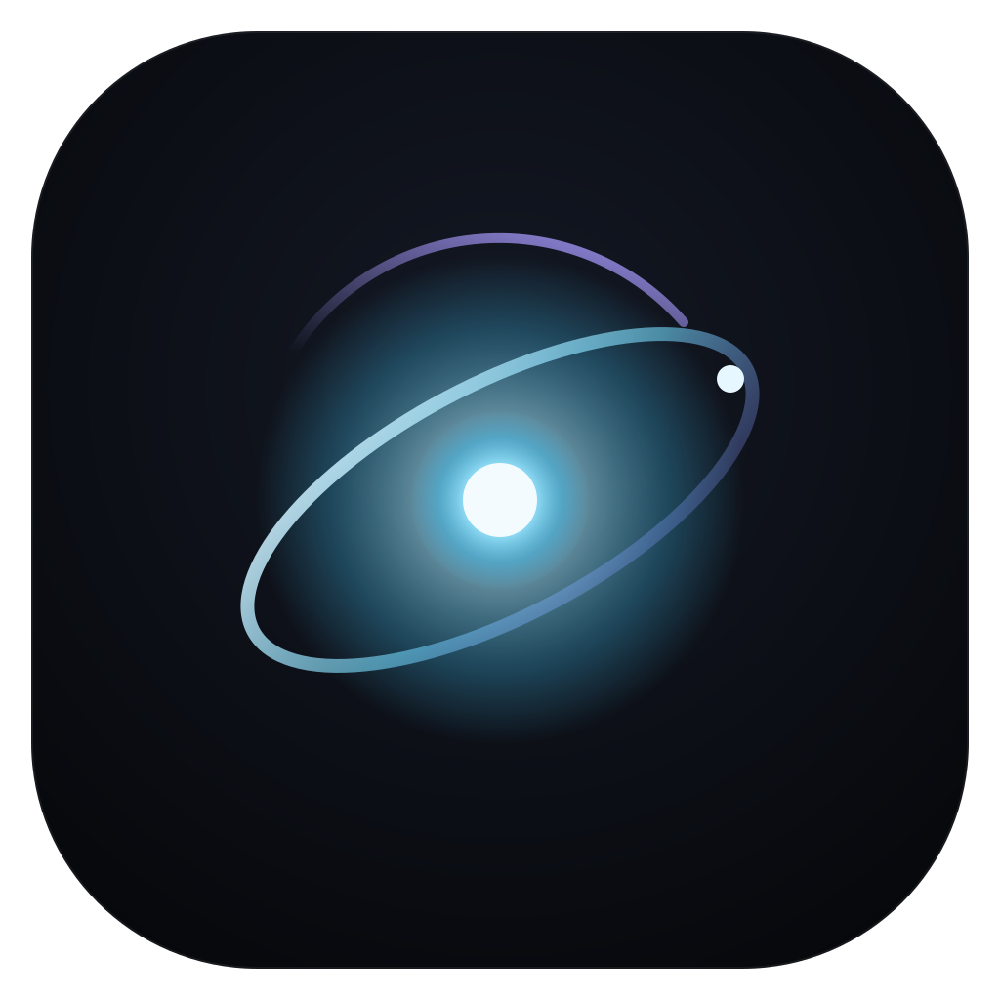
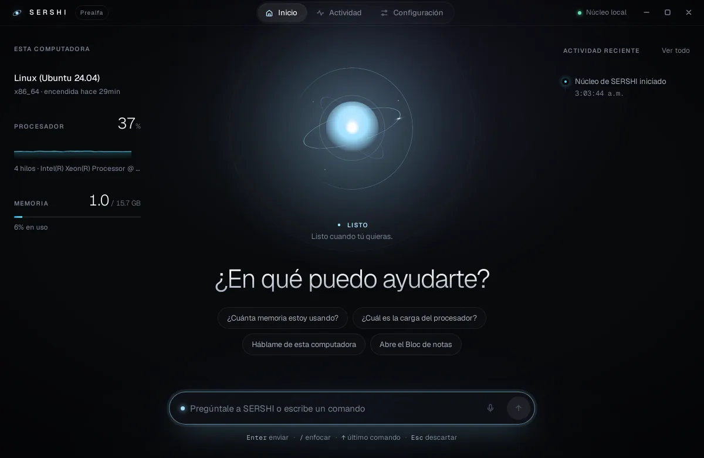
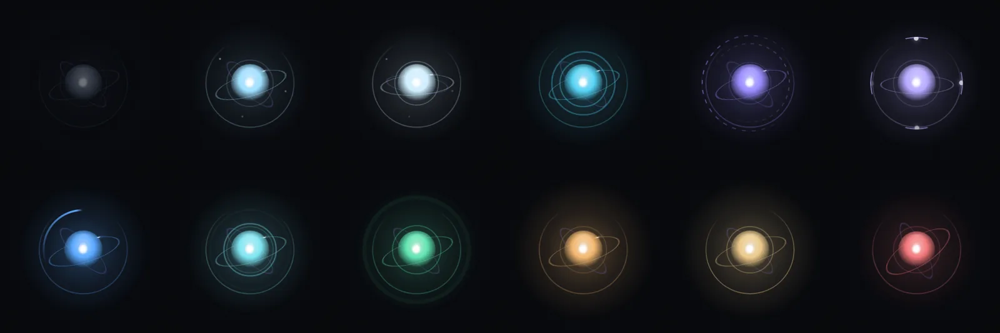

<p align="center">
  
</p>

<h1 align="center">SERSHI</h1>

<p align="center"><strong>Your intelligent desktop companion.</strong><br/>
An open-source AI agent that lives on your computer.</p>

<p align="center"><em>Early development · pre-alpha · not ready for everyday use</em></p>



## What is SERSHI?

SERSHI is a Windows-first desktop assistant that sits on your screen as a calm,
animated presence. You tell it what you want — "How much memory am I using?",
eventually "Open my project in VS Code" or "Start work mode" — and it acts through
safe, typed, permissioned tools, showing you what it is doing at every step.

It is designed to be **local-first** (useful without paid API keys), **private**
(no hidden recording, no analytics), **safe** (a language model can never run
commands directly) and **beautiful** (motion and light communicate its state).

## Project status

Pre-alpha. The architecture is in place and proven end to end; capabilities are
deliberately minimal.

| Works today                                                                 | Not yet                                                        |
| --------------------------------------------------------------------------- | -------------------------------------------------------------- |
| Command Center (Home, Activity, Settings) and floating companion            | AI provider / natural language understanding (v0.1)            |
| Shared assistant state with animated transitions across both windows        | Opening apps, files, battery (v0.1)                            |
| Typed command pipeline: intent → policy → tool → audit → response           | Confirmation UI, persistent settings (v0.1)                    |
| Safe tools: system info, memory, processor load                             | Voice (v0.3), e-mail/calendar (v0.4), skills (v0.5)            |
| Live telemetry, activity log, developer state preview                       | Installer for end users (v0.9)                                 |

Anything SERSHI can't do yet, it says so. Windows-specific window behaviour is
**not yet validated on Windows hardware** — see
[Windows platform](docs/WINDOWS_PLATFORM.md#validation-status).



## Architecture in brief

```text
React UI (Command Center, companion)          WebView — unprivileged
        │  narrow typed IPC, per-window permissions
        ▼
Tauri shell (Rust)                             windows, commands, events
        ▼
sershi-core (Rust, portable)                   state machine · intent · policy · tools · activity
        ▼  ports
sershi-platform (Rust)                         OS adapters; Win32 isolated in windows/
```

A language model (from v0.1) can only propose calls to registered tools. Every call
passes a policy engine that decides from the tool's declared risk and your
permissions; risky actions always ask first. Read more in
[Architecture](docs/ARCHITECTURE.md), [Agent model](docs/AGENT_MODEL.md) and
[Security](docs/SECURITY.md).

## Development

Requirements: Node.js ≥ 22.12, pnpm (via `corepack enable`), Rust stable, and the
[Tauri prerequisites](https://v2.tauri.app/start/prerequisites/) for your OS.

```bash
pnpm install
pnpm dev            # run SERSHI (Tauri + Vite)
pnpm dev:web        # UI only, in a browser, without the Rust core
pnpm check          # format, lint, typecheck, tests, build (TypeScript)
pnpm check:rust     # fmt, clippy, tests (Rust)
```

On Windows, follow [docs/WINDOWS_PLATFORM.md](docs/WINDOWS_PLATFORM.md) for exact
prerequisites, commands and the manual validation checklist.

```text
apps/desktop/            React app (src/) and Tauri shell (src-tauri/)
crates/sershi-core/      portable domain and application layer
crates/sershi-platform/  OS adapters (windows/ for Win32)
packages/contracts/      IPC types generated from Rust + guards
packages/design-tokens/  design tokens and runtime theming
docs/                    architecture, security, design, ADRs
```

## Documentation

[Product](docs/PRODUCT.md) · [Architecture](docs/ARCHITECTURE.md) ·
[Agent model](docs/AGENT_MODEL.md) · [Security](docs/SECURITY.md) ·
[Design system](docs/DESIGN_SYSTEM.md) · [Motion](docs/MOTION_SYSTEM.md) ·
[Brand](docs/BRAND.md) · [Windows](docs/WINDOWS_PLATFORM.md) ·
[Testing](docs/TESTING.md) · [Skills](docs/SKILLS.md) · [Memory](docs/MEMORY.md) ·
[Roadmap](docs/ROADMAP.md) · [Decisions](docs/adr/README.md)

## Roadmap

v0.1 Operator → v0.2 Context → v0.3 Voice → v0.4 Connected life → v0.5 Skills →
v0.6 Routines → v0.7 Memory → v0.8 Customisation → v0.9 Hardening → v1.0 Stable.
Details and exit criteria: [docs/ROADMAP.md](docs/ROADMAP.md).

## Security

Please report vulnerabilities privately — see [SECURITY.md](SECURITY.md).

## Contributing

Contributions are welcome once the foundation settles; start with
[CONTRIBUTING.md](CONTRIBUTING.md).

## License

[Apache-2.0](LICENSE) (proposed; see [ADR 0008](docs/adr/0008-license.md)).
