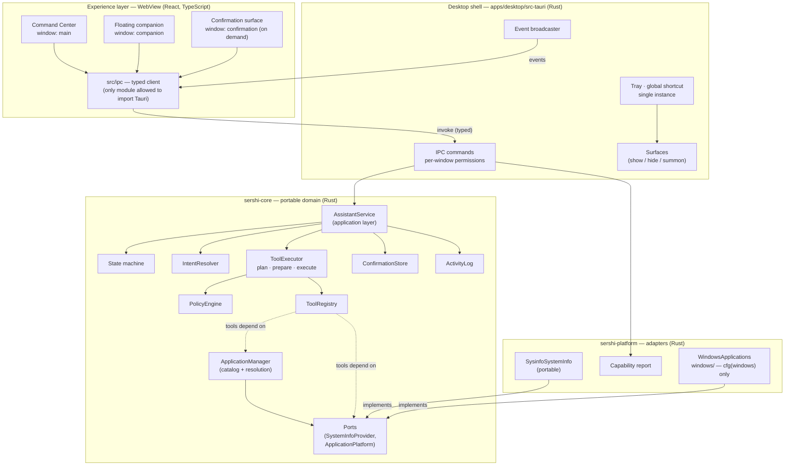
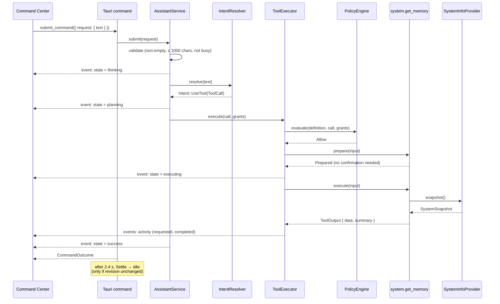
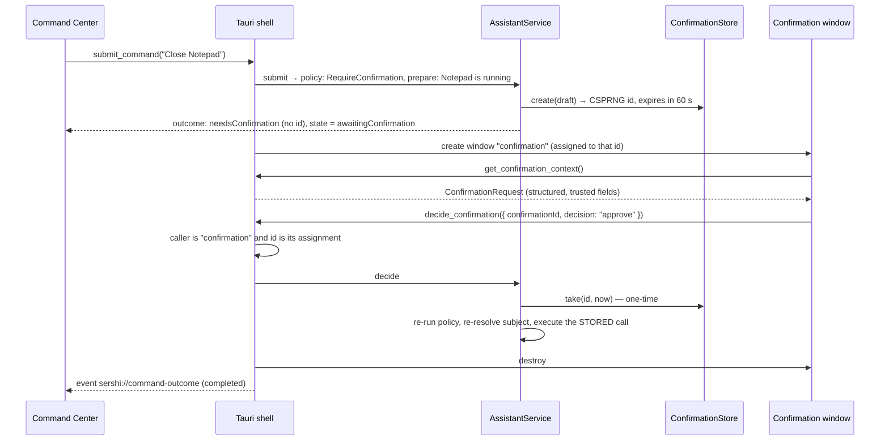
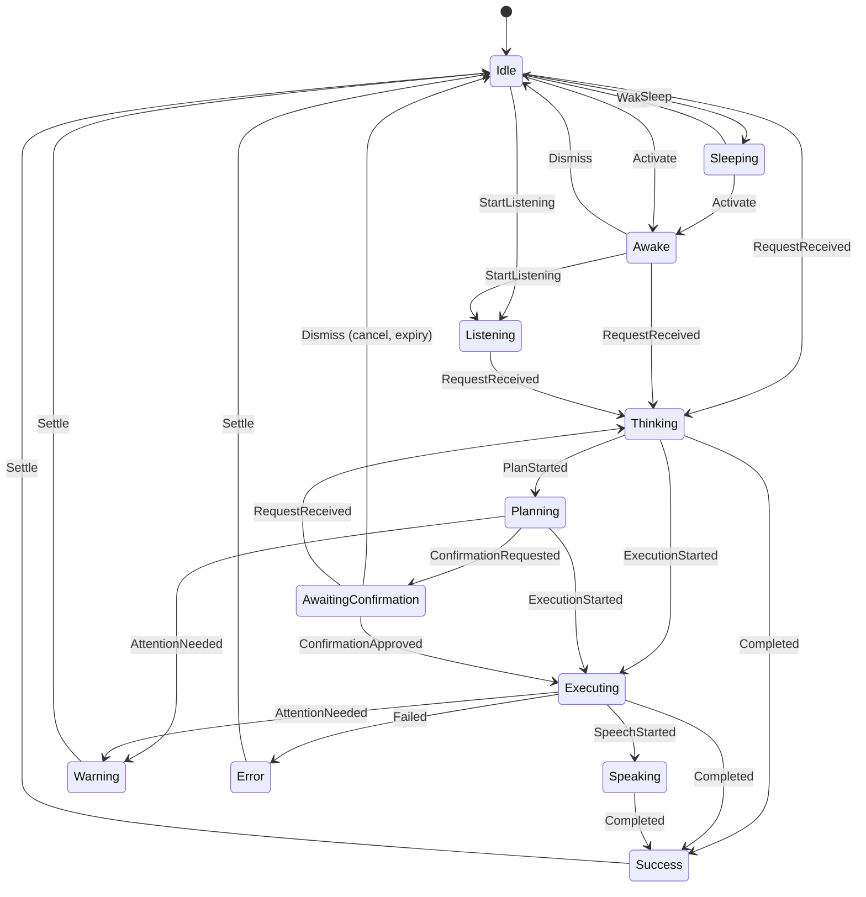

# Architecture

SERSHI is a Windows-first desktop application built on **Tauri 2**: a Rust process
owns everything privileged, and React renders three windows — the Command Center,
the floating companion and, only while an approval is pending, the trusted
confirmation window — that only ever _ask_ the Rust side for things through
narrow, typed IPC commands.

This document describes the system as it exists now and the boundaries that later
versions must respect. Decisions and their alternatives are recorded in
[`adr/`](adr/).

## System overview



## Layers and dependency rule

Dependencies point inward. The domain knows nothing about Tauri, React, Windows or
any AI vendor.

```text
React UI  ──IPC──▶  Desktop shell  ──▶  Application (AssistantService)
                                             │
                                             ▼
                                   Domain (state, tools, policy, activity)
                                             │
                                             ▼
                                        Ports (traits)
                                             ▲
                                             │ implements
                                   Adapters (sershi-platform, future providers)
```

| Unit                          | Kind          | Owns                                                                                                                  | May depend on                               |
| ----------------------------- | ------------- | --------------------------------------------------------------------------------------------------------------------- | ------------------------------------------- |
| `crates/sershi-core`          | Rust lib      | Assistant state machine, tool model, policy, permissions, confirmations, application catalog, activity, intent boundary, application service, IPC payloads | `serde`, `thiserror` (+ `ts-rs` behind a feature) |
| `crates/sershi-platform`      | Rust lib      | OS adapters for core ports; capability report; `windows/` module (the only code allowed `unsafe`, for Win32 FFI)       | `sershi-core`, `sysinfo`, `windows` (Windows only) |
| `apps/desktop/src-tauri`      | Rust bin/lib  | Windows, IPC commands, event broadcast, timers, tray, global shortcut, single instance                                | `sershi-core`, `sershi-platform`, `tauri` + plugins |
| `packages/contracts`          | TS package    | IPC types (generated from Rust), command/event map, runtime guards                                                    | —                                           |
| `packages/design-tokens`      | TS package    | Design tokens and runtime theming                                                                                      | —                                           |
| `apps/desktop/src`            | React app     | Both window UIs, stores mirroring core state                                                                          | `@sershi/contracts`, `@sershi/design-tokens`, `@tauri-apps/api` (in `src/ipc` only) |

Why so few crates: see [ADR 0002](adr/0002-process-and-module-boundaries.md). A new
crate is created when a boundary needs enforcing by the compiler (e.g. a future
`sershi-storage` so the core cannot touch SQLite), not to look organised.

## The request lifecycle

The vertical slice implemented today (a safe, read-only tool). Every future capability (LLM tool calls,
voice, routines) enters at the same point and passes through the same steps.



The executor splits every call into three steps so that anything a tool must
look up before acting (resolving an application, checking it is running)
happens during **Planning**, before any approval is requested:

1. **plan** — registry lookup, input validation, policy (`Allow` / `Deny` /
   `RequireConfirmation`).
2. **prepare** — the tool's own read-only checks; it may answer early
   (`ToolError::Declined`: "not found", "isn't running") or describe what a
   confirmation should name (`ConfirmationSubject`, from trusted data).
3. **execute** — the side effect, only after policy allowed it or the user
   approved it.

### Confirmation lifecycle

Sensitive actions (today: `system.close_application`) stop in
`AwaitingConfirmation`. The pending call lives in Rust; approval happens only
in a dedicated confirmation window that Rust creates and destroys. See
[ADR 0010](adr/0010-trusted-confirmation-lifecycle.md) and
[ADR 0011](adr/0011-dedicated-confirmation-surface.md).



- **Shell side** (`src-tauri/src/confirmation.rs`): a `SurfaceAssignment`
  (from the core) records which confirmation the window shows. `sync()`
  reconciles it with the core after every change: open, reload for a
  replacement, or destroy. Closing the window (× or the OS close request)
  cancels its own confirmation only.
- **Expiry**: enforced by the store at decision time; a timer at TTL + 250 ms
  also expires it, destroys the window and reports the outcome.
- **Cancellation from elsewhere**: a new request, Escape (dismiss), hiding the
  Command Center and quitting cancel the pending confirmation and destroy the
  window. Summoning SERSHI while one is pending brings the window forward.

### Application catalog

`ApplicationManager` (core) caches the catalog produced by the
`ApplicationPlatform` port and resolves names deterministically
(exact → alias → prefix → words; ambiguity is reported, never guessed). The
Windows adapter (`WindowsApplications`) discovers built-ins, packaged apps,
Start Menu shortcuts and App Paths, launches without a shell and closes only
with `WM_CLOSE`. Details: [APPLICATIONS.md](APPLICATIONS.md),
[ADR 0009](adr/0009-windows-application-discovery.md).

## IPC

IPC is a trust boundary (see [SECURITY.md](SECURITY.md)). Rules:

1. **Narrow, typed commands only.** There is no `run_command`, `exec` or `invoke_tool`.
   A contract test fails if a command name even resembles generic execution.
2. **Per-window permissions.** `build.rs` declares every command; Tauri generates a
   permission per command; `capabilities/*.json` grants them per window. The
   companion can call exactly `get_assistant_snapshot` and `summon_command_center`;
   the confirmation window exactly `get_confirmation_context` and
   `decide_confirmation`, which no other window has.
3. **Types come from Rust.** `ts-rs` generates `packages/contracts/src/generated`
   from the Rust types. `pnpm contracts:generate` regenerates; CI fails on drift.
4. **Rust-serialized fixtures** (`packages/contracts/fixtures`) are validated by the
   TypeScript guards, proving both sides agree on the wire format.
5. **Responses and events are guarded at runtime** in `src/ipc`; malformed payloads
   are dropped at the edge.

| Command                   | Windows            | Purpose                                             |
| ------------------------- | ------------------ | --------------------------------------------------- |
| `get_assistant_snapshot`  | main, companion    | Current assistant state                             |
| `summon_command_center`   | companion          | Show the Command Center, `Activate` the assistant   |
| `get_system_snapshot`     | main               | Read-only telemetry (polled while visible)          |
| `get_runtime_info`        | main               | Version, platform, capabilities, tool definitions   |
| `list_activity`           | main               | Recent activity (≤ 100)                             |
| `submit_command`          | main               | Run a user command through the pipeline (async; states broadcast live) |
| `get_confirmation_context`| confirmation       | The window's assigned confirmation (structured fields) |
| `decide_confirmation`     | confirmation       | `{ confirmationId, decision: "approve" \| "cancel" }` — nothing else |
| `get_application_catalog` | main               | Catalog status; names and sources in developer builds only |
| `refresh_application_catalog` | main           | Re-scan installed applications                      |
| `get_integration_status`  | main               | Tray, shortcut, single-instance status              |
| `set_tray_labels`         | main               | Localized tray labels (≤ 48 chars, no control chars; actions are fixed) |
| `hide_command_center`     | main               | × button: hide, keep running                        |
| `dismiss_assistant`       | main               | `Awake`/`AwaitingConfirmation → Idle` (cancels pending approvals) |
| `preview_assistant_state` | main               | Developer builds only: visual preview               |
| `quit_app`                | main               | Exit                                                |

| Event                      | Payload             | Target      |
| -------------------------- | ------------------- | ----------- |
| `sershi://assistant-state` | `AssistantSnapshot` | all windows |
| `sershi://activity`        | `ActivityEntry`     | all windows |
| `sershi://focus-command`   | none                | main        |
| `sershi://command-outcome` | `CommandOutcome`    | main (outcome of a confirmation decided, cancelled or expired elsewhere) |

**Telemetry vs tools.** `get_system_snapshot` is the user looking at their own
machine; it bypasses the tool pipeline and is not recorded as activity (it is
polled). Anything the _assistant_ does goes through tools. Future telemetry that
reveals user data (process lists, window titles) must become a tool.

## Assistant state

One state machine in Rust (`sershi-core::assistant`) is the single source of truth.
Both windows mirror the latest `AssistantSnapshot`; the UI never computes state.



(Abridged; `transition()` in `assistant.rs` is the authoritative, exhaustively
tested definition. Any non-sleeping state can `Fail`; busy states cannot `Sleep`.)

- **States vs conditions.** _Offline_ and _private_ are conditions layered on top of
  a state, not states — they describe the environment, not what SERSHI is doing.
- **Revisions.** Every change increments `revision`. Deferred work (the settle timer)
  applies only if the revision is unchanged, so a new request is never clobbered.
- **Preview.** Developer Mode can set `previewState`; surfaces render it, but policy
  and execution only ever read `state`.

## Desktop shell and window lifecycle

- **Single instance** (`tauri-plugin-single-instance`, registered first): a
  second launch shows the existing windows instead of starting a new process.
- **Close hides.** The Command Center's × and the OS close request hide the
  window; SERSHI keeps running in the tray. Quit is explicit (tray menu,
  Settings → About).
- **Tray** — Open / Hide / Quit (labels follow the UI language via
  `set_tray_labels`); left click summons.
- **Global shortcut** — `Ctrl+Alt+Space` summons: show, restore, focus, then
  emit `sershi://focus-command` so the input is focused. If Windows refuses
  focus, `request_user_attention` flashes the taskbar button instead. If the
  shortcut is taken, SERSHI keeps running and Settings says so.
- **Summon semantics** — tray click, shortcut, second instance and the
  companion all call the same `surfaces::summon`.

All of it is REQUIRES_WINDOWS_VALIDATION; see
[WINDOWS_PLATFORM.md](WINDOWS_PLATFORM.md).

## Frontend architecture

- **Three entry points** (`index.html`, `companion.html`, `confirmation.html`),
  one Vite build. The confirmation entry contains only its surface (no
  Command Center code) and its own IPC module (`src/ipc/confirmation.ts`),
  which no other surface imports.
- **`src/ipc`** — the only module that imports `@tauri-apps/api` (ESLint-enforced).
- **`src/state`** — small Zustand stores that _mirror_ core state (assistant, activity)
  or hold session-only UI state (conversation). See [ADR 0007](adr/0007-frontend-state-management.md).
- **`src/components`** — presentational components; `Core` is a pure renderer of
  `AssistantState`, replaceable by future companion packs.
- **Styling** — CSS Modules + design tokens as CSS custom properties. No utility
  framework; no hard-coded visual values ([DESIGN_SYSTEM.md](DESIGN_SYSTEM.md)).
- **Localization** — `src/i18n` owns every user-facing string (en-US, es-419,
  pt-BR). The core returns structured outcomes; the UI phrases them in the
  interface language. See [LOCALIZATION.md](LOCALIZATION.md).
- **Browser preview** — `pnpm dev:web` runs the UI without the Rust core. Every
  surface shows honest "not connected" states; `?preview=<state>` previews visuals.

## Persistence, credentials, providers

Designed, not yet implemented — see ADRs [0004](adr/0004-persistence.md) and
[0005](adr/0005-ai-provider-abstraction.md). Summary:

- **SQLite** (via `rusqlite`, bundled) owned by a future `sershi-storage` crate for
  settings, grants, activity history, routines and memory metadata. Never secrets.
- **Secrets** in the OS credential store (Windows Credential Manager) behind a
  `CredentialStore` port.
- **AI providers** behind capability-specific ports (`LlmProvider`,
  `SpeechToTextProvider`, …). A model-backed `IntentResolver` is just another
  implementation whose tool calls carry `CallOrigin::Agent`.

## Observability

- **Activity** (implemented) is the user-facing audit log: fixed-template summaries,
  tool ids and durations; never user text, payloads, paths or secrets.
- **Diagnostics** (planned, Developer Mode): structured `tracing` events —
  `assistant.state_changed`, `tool.requested|approved|denied|started|completed|failed`,
  `permission.requested|denied`, `provider.error` — with the same redaction rules.
- **Performance** (planned): startup time, idle CPU/RAM, frame health, tool and
  provider latency. Tool latency is already recorded (`durationMs`).

## Performance principles

- Nothing heavy at startup: no models, no network, one `sysinfo` handle. The
  application catalog warms up in the background 5 s after launch.
- Native calls are bounded (discovery 20 s, launch 10 s, close 5 s) and run
  off the UI thread; commands that may touch them are `async` IPC commands.
- Telemetry polls only while the Command Center is visible (2 s interval).
- The companion animates only `transform`/`opacity`; loops pause when sleeping.
- No continuous canvas or WebGL rendering.

## Adding a capability (checklist)

1. Define or reuse a **port** in `sershi-core::ports` if the capability touches the OS
   or a vendor.
2. Implement the **adapter** in `sershi-platform` (Windows-only code under `windows/`).
3. Add a **tool** with an honest `RiskLevel`, required permissions, typed input with
   `deny_unknown_fields`, and a human summary.
4. Add **policy tests** for its risk and permission behaviour.
5. Update the **capability report** (`requiresWindowsValidation` until verified).
6. Run `pnpm contracts:generate` if IPC payloads changed.
