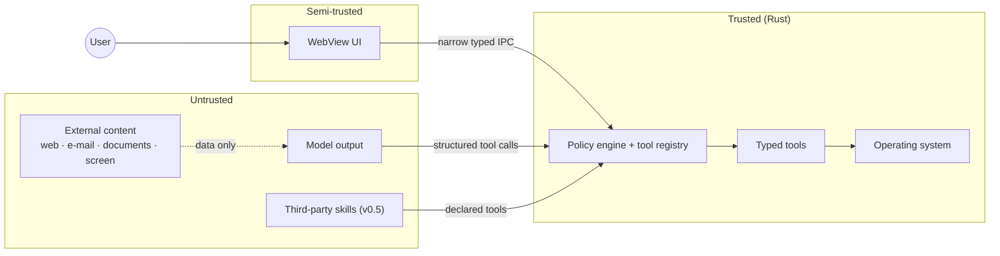

# Security model

SERSHI will eventually see the user's screen, hear their microphone, read their
files and act on their computer. Security is therefore an architectural property,
not a feature. This document is the threat model and the rules that follow from
it. To report a vulnerability, see the root [`SECURITY.md`](../SECURITY.md).

## Assets

| Asset                                    | Why it matters                                |
| ---------------------------------------- | --------------------------------------------- |
| The user's files, apps and settings      | SERSHI can act on them                        |
| Credentials (API keys, OAuth tokens)     | Access to paid services and personal accounts |
| Microphone and screen content            | Highly sensitive, often incidental            |
| Conversation, memory and activity        | A detailed profile of the user                |
| Integrity of SERSHI's own decisions      | Everything above depends on it                |

## Trust boundaries



| Boundary                 | Rule                                                                                                                                  |
| ------------------------ | ------------------------------------------------------------------------------------------------------------------------------------- |
| **Model → system**       | Model output is untrusted data. It can only _name_ a registered tool and supply typed input. It never becomes a shell command. Risk comes from the tool definition, not the model. |
| **External content → model** | Web pages, e-mails, documents and screen text are data. Instructions inside them never override system policy, permissions or confirmation. Content is delimited as untrusted when given to a model, and actions derived from it carry `CallOrigin::Agent`, which requires confirmation for anything sensitive. |
| **WebView → Rust (IPC)** | The UI is treated as potentially compromised (e.g. by a rendering bug or injected content). It gets narrow commands only, scoped per window; no generic execution; inputs validated in Rust. |
| **Skills → system**      | Third-party skills get no ambient authority: declared permissions, user approval, their own namespace, revocable. See [SKILLS.md](SKILLS.md). |

## Implemented controls (v0.0.x)

| Control                                    | Where                                                        | Verified by                                          |
| ------------------------------------------ | ------------------------------------------------------------ | ---------------------------------------------------- |
| No shell/exec tool or IPC command           | `sershi-core::tool`, `build.rs`                              | `commands.test.ts` ("no command resembles generic execution") |
| Per-window command permissions              | `src-tauri/capabilities/*.json`                              | `commands.test.ts` (companion allow-list)            |
| Policy engine on every tool call            | `sershi-core::policy`, `executor`                            | `policy.rs`, `executor.rs` tests                     |
| Denied / unconfirmed tools never execute    | `executor.rs`                                                | `confirmation_and_denial_never_execute_the_tool`     |
| High-risk actions always confirm, never rememberable | `policy.rs`                                         | `high_risk_always_confirms_and_cannot_be_remembered` |
| Model-proposed sensitive actions confirm    | `policy.rs`                                                  | `model_proposed_sensitive_actions_need_confirmation_even_when_granted` |
| Validated identifiers (no injection via ids) | `sershi-core::ids`                                          | `rejects_malformed_or_hostile_ids`                   |
| Strict tool inputs (`deny_unknown_fields`)  | `tool::parse_input`                                          | `rejects_unexpected_input`                           |
| Command length limit (1000 chars)           | `service.rs`                                                 | `invalid_requests_are_rejected_without_state_changes` |
| Activity never stores user text or error details | `service.rs`, `executor.rs`                             | `user_command_text_never_reaches_the_activity_log`, `failures_are_reported_without_leaking_details_into_activity` |
| Strict Content-Security-Policy              | `tauri.conf.json` (`script-src 'self'`, `style-src 'self'`, no remote origins) | Manual review                                |
| Frozen JS prototypes                        | `tauri.conf.json` `freezePrototype`                          | Manual review                                        |
| Only `src/ipc` may import Tauri APIs        | `eslint.config.js`                                           | `pnpm lint`                                          |
| No `unsafe` Rust; no `unwrap`/`expect`/`panic` in production code | Workspace lints                        | `cargo clippy -D warnings`                           |
| No secrets in the repository                | `.gitignore` (`.env*`, keys)                                 | Review                                               |
| No telemetry or network calls               | Fonts bundled locally; CSP `connect-src` is IPC only         | Review                                               |
| Install scripts restricted                  | `pnpm-workspace.yaml` `onlyBuiltDependencies`                | Review                                               |

## Permissions and risk

| Risk          | Examples                                                   | Default behaviour                                                                                      |
| ------------- | ---------------------------------------------------------- | ------------------------------------------------------------------------------------------------------ |
| **Safe**      | Read CPU/RAM, open an app, pause media, search allowed folders | Runs if its permissions are granted; asks if undecided                                             |
| **Sensitive** | Move/rename files, send e-mail, change settings, run a script | Runs for user-originated calls with granted permissions; **model-proposed calls always confirm**   |
| **High risk** | Delete files, payments, credential or security changes, installing software | **Always confirms; "remember" is never offered**                                  |
| **Prohibited**| Anything on the policy deny-list                            | Never runs                                                                                             |

Permissions are namespaced (`system.info.read`, `files.write`, `spotify.control`)
with per-user state `granted` / `ask` / `denied`. Only `system.info.read` is granted
by default. Grants are user data (persisted in v0.1), never inferred by a model, and
changing personality or prompts cannot change them.

### Confirmation design (v0.1, with the first sensitive tool)

A confirmation must state **what** SERSHI wants to do, **what data** is affected,
**why** it needs permission, and **whether** the decision can be remembered.

```text
SERSHI wants to move 14 PDF files

From   Downloads
To     Documents\Invoices

This needs permission to modify files in Downloads.
☐ Always allow moving files within Documents      (not offered for high-risk actions)

[ Cancel ]                                   [ Move files ]
```

Never "Allow action?".

## Credentials

- Stored only in the OS credential store (Windows Credential Manager) behind a
  `CredentialStore` port ([ADR 0004](adr/0004-persistence.md)).
- Never in SQLite, JSON, `.env` (except git-ignored local development), logs, IPC
  payloads to the WebView, or activity.
- The UI can learn _whether_ a key is configured, never its value.

## Logging and privacy

Never logged anywhere: API keys, passwords, tokens, credentials, command text,
file contents, e-mail bodies, clipboard or screen content. Activity summaries are
fixed templates plus tool metadata. Tool error details (which may echo paths) are
kept out of activity and, in future diagnostics, redacted by default.

SERSHI sends **no analytics**. Any future telemetry must be opt-in, documented and
privacy-preserving.

## Microphone and screen (v0.2–v0.3)

- No hidden capture. Listening and screen capture always show a visible,
  state-driven indicator on the companion; the Listening state exists for this.
- Push-to-talk and "wake word disabled" modes; a hardware-style mute that the
  voice pipeline cannot override.
- Wake-word detection runs locally; audio is not retained after transcription
  unless the user opts in.
- Screen capture is per-request and user-initiated, never continuous.

## Threats and mitigations

| Threat                                              | Mitigation                                                                                      |
| --------------------------------------------------- | ----------------------------------------------------------------------------------------------- |
| Prompt injection from web/e-mail/screen content     | Content is data; typed tools only; `Agent` origin → confirmation for sensitive/high-risk; confirmations show concrete effects |
| Model hallucinates a destructive action             | Risk from definitions; high-risk always confirms; no shell                                      |
| Compromised WebView issues IPC calls                | Narrow commands, per-window permissions, Rust-side validation, strict CSP                       |
| Malicious or buggy third-party skill                | Declared permissions, own namespace, approval, revocation; later: signing and process isolation |
| Credential theft from disk                          | OS credential store; nothing plaintext                                                          |
| Sensitive data in logs or bug reports               | Template-only activity; redaction rules for diagnostics                                         |
| Supply-chain compromise via dependencies            | Minimal dependencies, lockfiles, restricted install scripts, `--locked` CI builds              |
| UI spoofing of confirmations                        | (v0.1) Confirmations rendered by trusted surfaces with state that the model cannot author       |

## Assumptions

- The local user account and OS are not compromised; SERSHI does not defend against
  malware already running as the user.
- The user is the only principal; multi-user and remote control are out of scope.
- Model providers may see what the user sends them; cloud use is opt-in and the UI
  will say which provider handles a request.
