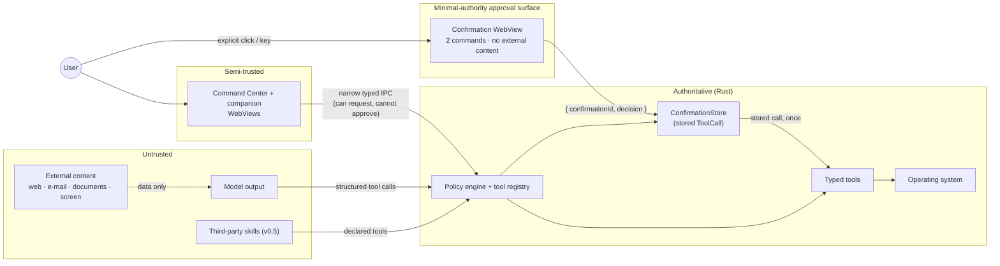

# Security model

SERSHI will eventually see the user's screen, hear their microphone, read their
files and act on their computer. Security is therefore an architectural property,
not a feature. This document is the threat model and the rules that follow from
it. To report a vulnerability, see the root [`SECURITY.md`](../SECURITY.md).

## Assets

| Asset                                    | Why it matters                                |
| ---------------------------------------- | --------------------------------------------- |
| The user's files, apps and settings      | SERSHI can act on them                        |
| Credentials (API keys, OAuth tokens)     | Access to paid services and personal accounts |
| Microphone and screen content            | Highly sensitive, often incidental            |
| Conversation, memory and activity        | A detailed profile of the user                |
| Integrity of SERSHI's own decisions      | Everything above depends on it                |

## Trust boundaries



| Boundary                 | Rule                                                                                                                                  |
| ------------------------ | ------------------------------------------------------------------------------------------------------------------------------------- |
| **Model → system**       | Model output is untrusted data. It can only _name_ a registered tool and supply typed input. It never becomes a shell command. Risk comes from the tool definition, not the model. |
| **External content → model** | Web pages, e-mails, documents and screen text are data. Instructions inside them never override system policy, permissions or confirmation. Content is delimited as untrusted when given to a model, and actions derived from it carry `CallOrigin::Agent`, which requires confirmation for anything sensitive. |
| **WebView → Rust (IPC)** | The UI is treated as potentially compromised (e.g. by a rendering bug or injected content). It gets narrow commands only, scoped per window; no generic execution; inputs validated in Rust. The Command Center and companion can **request** actions but hold **no approval channel**. |
| **Confirmation surface → Rust** | A separate, Rust-created window whose only authority is to read its assigned confirmation and return the human decision (`{ confirmationId, decision }`). It renders only structured, SERSHI-owned fields. It is a smaller target, **not** an enclave (see below). |
| **Rust core**            | Authoritative: owns the pending `ToolCall`, policy, permissions, expiry and replay prevention. Never reconstructs an action from UI input. |
| **Skills → system**      | Third-party skills get no ambient authority: declared permissions, user approval, their own namespace, revocable. See [SKILLS.md](SKILLS.md). |

## Implemented controls (v0.0.x)

| Control                                    | Where                                                        | Verified by                                          |
| ------------------------------------------ | ------------------------------------------------------------ | ---------------------------------------------------- |
| No shell/exec tool or IPC command           | `sershi-core::tool`, `build.rs`                              | `commands.test.ts` ("no command resembles generic execution") |
| Per-window command permissions              | `src-tauri/capabilities/*.json`                              | `commands.test.ts` (companion allow-list)            |
| Policy engine on every tool call            | `sershi-core::policy`, `executor`                            | `policy.rs`, `executor.rs` tests                     |
| Denied / unconfirmed tools never execute    | `executor.rs`                                                | `confirmation_and_denial_never_execute_the_tool`     |
| High-risk actions always confirm, never rememberable | `policy.rs`                                         | `high_risk_always_confirms_and_cannot_be_remembered` |
| Model-proposed sensitive actions confirm    | `policy.rs`                                                  | `model_proposed_sensitive_actions_need_confirmation_even_when_granted` |
| Validated identifiers (no injection via ids) | `sershi-core::ids`                                          | `rejects_malformed_or_hostile_ids`                   |
| Strict tool inputs (`deny_unknown_fields`)  | `tool::parse_input`                                          | `rejects_unexpected_input`                           |
| Command length limit (1000 chars)           | `service/`                                                   | `invalid_requests_are_rejected_without_state_changes` |
| Activity never stores user text or error details | `service/`, `executor.rs`                               | `user_command_text_never_reaches_the_activity_log`, `failures_are_reported_without_leaking_details_into_activity` |
| Application tools take a name, never a path, command or argument | `apps/tools.rs` (`requested_name`, ≤ 80 chars, `\ / : < > \| " * ?` and control chars rejected) | `never_accepts_paths_commands_or_extra_fields`, `application_names_are_passed_as_data_not_commands` |
| Launch without a shell (`CreateProcessW`, `IApplicationActivationManager`; `ShellExecuteExW` only for fixed `ms-settings:` and installer shortcuts) | `sershi-platform/src/windows/launch.rs`, `packaged.rs` | Review; `cargo clippy --target x86_64-pc-windows-msvc` |
| Ambiguous or unknown names never launch     | `apps/catalog.rs`, `apps/tools.rs`                           | `ambiguous_requests_are_never_guessed`, `not_found_and_ambiguous_never_launch` |
| Close is graceful only (`WM_CLOSE`; no `TerminateProcess`, no `taskkill`) and never targets Explorer, Settings or SERSHI | `windows/close.rs`, `windows/known.rs` | Review |
| No elevation: SERSHI never requests administrator rights or triggers UAC itself | `windows/launch.rs` (`ERROR_ELEVATION_REQUIRED` → structured error) | `launch_errors_are_structured_without_internal_details` |
| Trusted confirmations (see below)           | `confirmation.rs`, `service/`, `executor.rs`                 | `service/tests.rs` confirmation suite, `confirmation.rs` tests |
| Only the confirmation window can decide confirmations; Command Center and companion cannot | `capabilities/confirmation.json` (exactly 2 commands), `command-center.json`, `companion.json`; label check in `src-tauri/src/confirmation.rs` | `commands.test.ts` ("only the confirmation window can decide confirmations", exact allow-list) |
| Decisions carry only `{ confirmationId, decision }` | `service/types.rs` (`deny_unknown_fields`)               | `decisions_carry_only_an_id_and_a_choice`            |
| The executed action is the stored call      | `service/mod.rs` `decide`                                    | `the_stored_call_is_what_runs`, `a_stale_surface_cannot_approve_a_replacement_confirmation` |
| Confirmation ids: 128 bits from the OS CSPRNG | `confirmation.rs` (`getrandom`)                            | `confirmation_ids_are_128_bit_random_values`         |
| Accidental-input guard on Approve           | `surfaces/confirmation/ConfirmationSurface.tsx`              | `confirmation-surface.test.tsx`                      |
| No paths in outcomes, activity or UI (`ApplicationSummary` only) | `apps/model.rs`, `apps/tools.rs`               | `commands.test.ts` ("no paths in outcomes"), `launch_errors_are_structured_without_internal_details` |
| Tray labels validated (≤ 48 chars, no control chars); actions fixed | `ipc.rs` `TrayLabels::is_valid`             | `ipc.rs` tests                                       |
| Strict Content-Security-Policy              | `tauri.conf.json` (`script-src 'self'`, `style-src 'self'`, no remote origins) | Manual review                                |
| Frozen JS prototypes                        | `tauri.conf.json` `freezePrototype`                          | Manual review                                        |
| Only `src/ipc` may import Tauri APIs        | `eslint.config.js`                                           | `pnpm lint`                                          |
| No `unsafe` Rust outside the Win32 FFI module; no `unwrap`/`expect`/`panic` in production code | Workspace lints (`unsafe_code = "deny"`; only `sershi-platform/src/windows` opts out, each block commented) | `cargo clippy -D warnings` (Linux and Windows targets) |
| No secrets in the repository                | `.gitignore` (`.env*`, keys)                                 | Review                                               |
| No telemetry or network calls               | Fonts bundled locally; CSP `connect-src` is IPC only         | Review                                               |
| Install scripts restricted                  | `pnpm-workspace.yaml` `onlyBuiltDependencies`                | Review                                               |

## Permissions and risk

| Risk          | Examples                                                   | Default behaviour                                                                                      |
| ------------- | ---------------------------------------------------------- | ------------------------------------------------------------------------------------------------------ |
| **Safe**      | Read CPU/RAM, open an app, pause media, search allowed folders | Runs if its permissions are granted; asks if undecided                                             |
| **Sensitive** | Move/rename files, send e-mail, change settings, run a script | Runs for user-originated calls with granted permissions; **model-proposed calls always confirm**   |
| **High risk** | Delete files, payments, credential or security changes, installing software | **Always confirms; "remember" is never offered**                                  |
| **Prohibited**| Anything on the policy deny-list                            | Never runs                                                                                             |

Permissions are namespaced (`system.info.read`, `files.write`, `spotify.control`)
with per-user state `granted` / `ask` / `denied`. Granted by default:
`system.info.read` and `system.apps.launch` (opening an application the user
names is equivalent to clicking it in the Start Menu). `system.apps.close` is
`ask`, so closing always confirms. Grants are user data (persisted in v0.1), never inferred by a model, and
changing personality or prompts cannot change them.

### Trusted confirmations (implemented)

Sensitive actions (today: `system.close_application`) require explicit human
approval on a dedicated surface. Decisions: [ADR 0010](adr/0010-trusted-confirmation-lifecycle.md),
[ADR 0011](adr/0011-dedicated-confirmation-surface.md).

```text
Request (Command Center / future agent)
   → intent → tool → policy: RequireConfirmation
   → Rust stores PendingConfirmation { request, exact ToolCall }
   → Rust opens the confirmation window (label "confirmation")
   → window reads its assigned request, the human chooses Cancel / Approve
   → Rust: id matches the assigned, pending, unexpired confirmation → take() once
   → Rust re-runs policy, re-resolves the target, runs the STORED call
   → Rust destroys the window; the outcome goes to the Command Center
```

**Capability allocation**

| Surface               | Can                                                             | Cannot                                              |
| --------------------- | --------------------------------------------------------------- | --------------------------------------------------- |
| Command Center (main) | Submit requests, see that approval is pending, cancel (Escape, hide, new request) | Read confirmation ids or details, approve (`decide_confirmation`, `get_confirmation_context` not granted) |
| Companion             | Read state, summon                                              | Anything confirmation-related                       |
| Confirmation window   | `get_confirmation_context` (its assigned request only), `decide_confirmation` | Events, window control, telemetry, activity, catalog, settings, submitting commands, any other command |
| Rust core             | Owns the pending action, tool call, policy, expiry, replay prevention | —                                                   |

**Guarantees**

- **Stored, authoritative action.** The pending `ToolCall` never leaves Rust.
  The surface sends only `{ confirmationId, decision: "approve" | "cancel" }`;
  any extra field (tool, input, target, risk, permission) is rejected at
  deserialization. The frontend cannot change what runs.
- **Ids.** 16 bytes from the OS CSPRNG (`getrandom`: `ProcessPrng` on
  Windows), encoded as 32 lowercase hex characters; malformed ids are
  rejected at the boundary. Ids are **not passwords** and security does not
  depend on their secrecy: they are unpredictable, single-use, short-lived and
  bound to one stored action, and only the confirmation window — only for its
  assigned confirmation — may present one.
- **Single use.** `take()` consumes the confirmation on approve, cancel and
  expiry. Unknown or stale ids are rejected without disturbing the current
  confirmation (a stale window cannot approve or cancel a replacement).
- **One at a time.** One confirmation is pending at once; a new request
  cancels the previous one (nothing runs).
- **Expiry.** 60 s, enforced at decision time; a timer also expires it so the
  window closes and the Command Center returns to a safe state. Activity
  records the expiry.
- **Re-checks on approval.** Policy is re-run (a revoked permission still
  wins) and the application re-resolved; if it no longer matches what the
  user approved, nothing runs.
- **Closing is cancelling.** × on the surface, the OS close request (Alt+F4),
  Escape, hiding the Command Center, dismissing, and quitting SERSHI all
  cancel. Window close is never treated as approval.
- **Restart cancels.** Pending confirmations exist only in memory — never in
  `localStorage`, SQLite, files or logs. A crash or restart discards them;
  SERSHI never restores a sensitive pending action.
- **Trusted content only.** The surface shows SERSHI-owned localized copy
  selected by enums (`ConfirmationAction`, `ConfirmationLevel`, reason) plus
  the resolved subject from discovery (`ApplicationSummary`) — never request
  text, tool output, model output, web, e-mail or document content, HTML or
  Markdown.
- **Accidental-input resistance.** Cancel has initial focus (Enter cancels);
  Escape cancels. Approve is inert for 600 ms after the window is focused, is
  disarmed when the window loses focus, and accepts only a pointer press that
  began on it after arming or a fresh, non-repeated key press — so a click or
  held key that began before the window appeared cannot approve.
- **Window hardening.** Created only by Rust (the frontend has no
  window-creation permission); navigation restricted to the bundled
  `confirmation.html`; devtools disabled in release builds (the `devtools`
  feature is not enabled, and the builder also turns them off); always on
  top; the same strict CSP as every window.
- **Audit.** `confirmationRequired`, `confirmationApproved`,
  `confirmationCancelled`, `confirmationExpired` are recorded with the tool
  id and the resolved display name only — never the id, the raw input,
  paths or external content.
- **Remembering** is never offered today (`canRemember: false`).

**What the separate window is — and is not.** It shares the process, the
origin and the WebView2 runtime with the other windows, so it is **not a
security enclave**; a renderer or process compromise that escapes the
WebView sandbox is out of scope. Its value comes from a much smaller
capability set, no external or model-generated content, no general
application UI, a strict CSP and a single purpose. Tauri enforces the
per-window command allow-lists in Rust, and the two confirmation commands
also check the caller's window label.

### Defence in depth

No single control is treated as sufficient. An action runs only if all hold:
typed tool → policy engine → permission model → risk classification →
(when required) trusted confirmation surface → stored authoritative
`ToolCall` → one-time confirmation → expiry → per-window IPC capabilities.

### Invariants

- **The agent may request authority; it may never grant itself authority.**
  Approval enters only through `decide_confirmation`, granted to the
  confirmation window alone. Intent resolution, tools and (future) models have
  no path to it; typing "yes" in the Command Center is a new request, which
  cancels the pending confirmation (`typing_or_saying_yes_never_approves`).
- **External content never approves.** Web pages, e-mails, documents, screen
  OCR and model output are data; only direct human interaction with the
  confirmation surface approves.
- **Voice (v0.3).** Voice confirmation of sensitive actions is disabled unless
  a future, explicitly designed secure mechanism exists. Voice may cancel;
  approval remains an explicit UI interaction.

### Future hardening (not implemented)

- A **critical** confirmation level for payments, credential access, security
  settings and permanent deletion: hold to confirm, type the target's name, a
  second confirmation, or **Windows Hello** (user-presence verification).
  Ordinary sensitive actions will not require it.
- A native OS-drawn prompt for critical actions, as an additional channel
  outside the WebViews.
- Persistent "remember this decision" grants (never for high risk).

### Confirmation copy

A confirmation must state **what** SERSHI wants to do, **what data** is affected,
**why** it needs permission, and **whether** the decision can be remembered.

```text
SERSHI wants to move 14 PDF files

From   Downloads
To     Documents\Invoices

This needs permission to modify files in Downloads.
☐ Always allow moving files within Documents      (not offered for high-risk actions)

[ Cancel ]                                   [ Move files ]
```

Never "Allow action?".

## Credentials

- Stored only in the OS credential store (Windows Credential Manager) behind a
  `CredentialStore` port ([ADR 0004](adr/0004-persistence.md)).
- Never in SQLite, JSON, `.env` (except git-ignored local development), logs, IPC
  payloads to the WebView, or activity.
- The UI can learn _whether_ a key is configured, never its value.

## Logging and privacy

Never logged anywhere: API keys, passwords, tokens, credentials, command text,
file contents, e-mail bodies, clipboard or screen content. Activity summaries are
fixed templates plus tool metadata. Tool error details (which may echo paths) are
kept out of activity and, in future diagnostics, redacted by default.

SERSHI sends **no analytics**. Any future telemetry must be opt-in, documented and
privacy-preserving.

## Microphone and screen (v0.2–v0.3)

- No hidden capture. Listening and screen capture always show a visible,
  state-driven indicator on the companion; the Listening state exists for this.
- Push-to-talk and "wake word disabled" modes; a hardware-style mute that the
  voice pipeline cannot override.
- Wake-word detection runs locally; audio is not retained after transcription
  unless the user opts in.
- Screen capture is per-request and user-initiated, never continuous.

## Threats and mitigations

| Threat                                              | Mitigation                                                                                      |
| --------------------------------------------------- | ----------------------------------------------------------------------------------------------- |
| Prompt injection from web/e-mail/screen content     | Content is data; typed tools only; `Agent` origin → confirmation for sensitive/high-risk; confirmations show concrete effects |
| Model hallucinates a destructive action             | Risk from definitions; high-risk always confirms; no shell                                      |
| Compromised WebView issues IPC calls                | Narrow commands, per-window permissions, Rust-side validation, strict CSP                       |
| Malicious or buggy third-party skill                | Declared permissions, own namespace, approval, revocation; later: signing and process isolation |
| Credential theft from disk                          | OS credential store; nothing plaintext                                                          |
| Sensitive data in logs or bug reports               | Template-only activity; redaction rules for diagnostics                                         |
| Supply-chain compromise via dependencies            | Minimal dependencies, lockfiles, restricted install scripts, `--locked` CI builds              |
| UI spoofing of confirmations                        | Pending calls live in Rust; approval only from the dedicated confirmation window, only for its assigned id, once; subject from trusted discovery |
| Compromised Command Center approves its own request | The Command Center has no approval command or confirmation data; it can only request and cancel |
| Clickjacking / inherited clicks or keys             | Cancel focused first; Approve arming delay, press-must-start-on-button, repeat keys ignored; always-on-top surface |
| Text → command injection via application names      | Names are data resolved against a discovered catalog; no shell, no arguments, path-like input rejected |
| Launching a malicious binary                        | Only discovered targets (Start Menu, App Paths, packages, built-ins) can launch; SERSHI trusts what the user or an installer already registered, like the Start Menu does |
| Elevation abuse                                     | No elevation requests; `ERROR_ELEVATION_REQUIRED` is reported, never retried elevated           |
| Data loss by closing apps                           | Sensitive + confirmation; `WM_CLOSE` only, so apps can prompt to save; no forced termination   |

## Dependencies with a security role

| Crate       | Version | Purpose                                              | Why this one |
| ----------- | ------- | ---------------------------------------------------- | ------------ |
| `getrandom` | 0.3     | OS CSPRNG for confirmation ids (16 bytes)            | Minimal, widely audited, the primitive that `rand`/`ring` build on; already in the lockfile via Tauri, so no new code enters the build |

## Limitations

What the confirmation design does **not** defend against:

- Malware or another process running as the same Windows user (it can drive
  the UI, inject input or read process memory).
- A compromise of the SERSHI process or of the WebView2 runtime itself.
- A compromised Command Center **cancelling** pending actions or submitting
  new requests (both are safe directions; requests still pass policy and need
  approval when sensitive).
- A user deliberately approving a harmful action; SERSHI can only make the
  action and its risk clear.
- Social engineering outside SERSHI.
- Screen readers and accessibility tools that can activate buttons on the
  user's behalf, by design.

## Assumptions

- The local user account and OS are not compromised; SERSHI does not defend against
  malware already running as the user.
- The user is the only principal; multi-user and remote control are out of scope.
- Model providers may see what the user sends them; cloud use is opt-in and the UI
  will say which provider handles a request.
